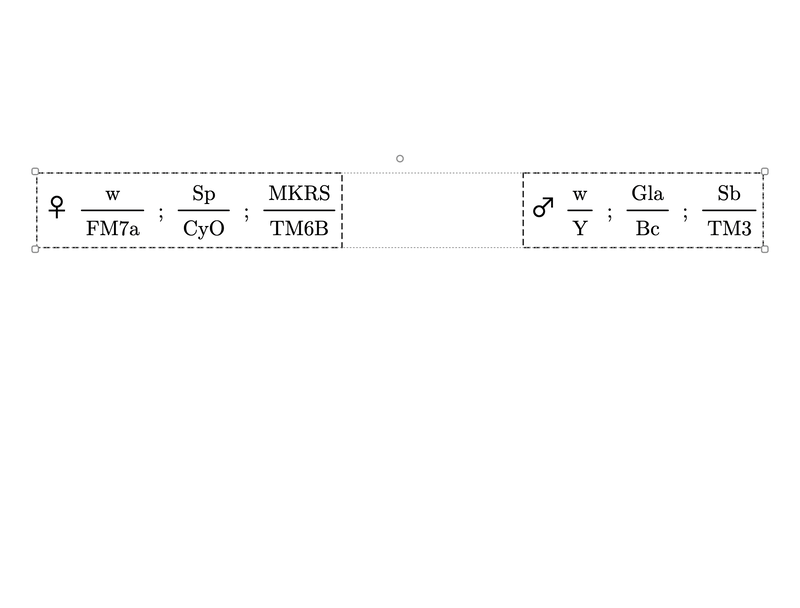
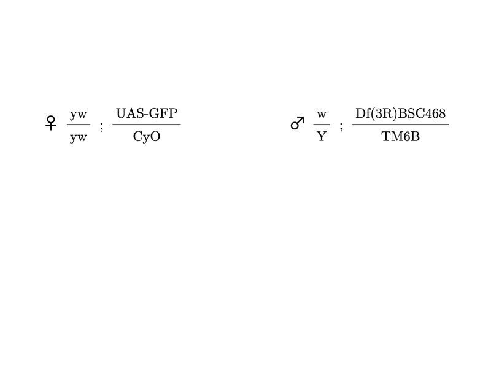
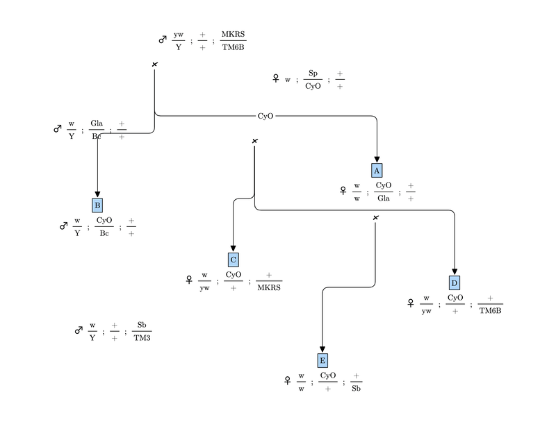
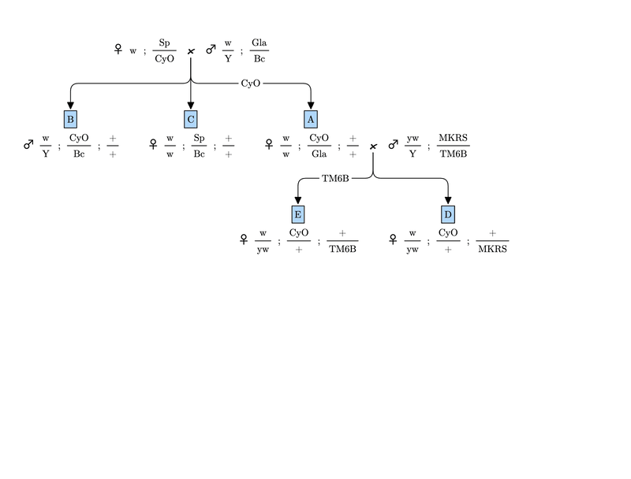
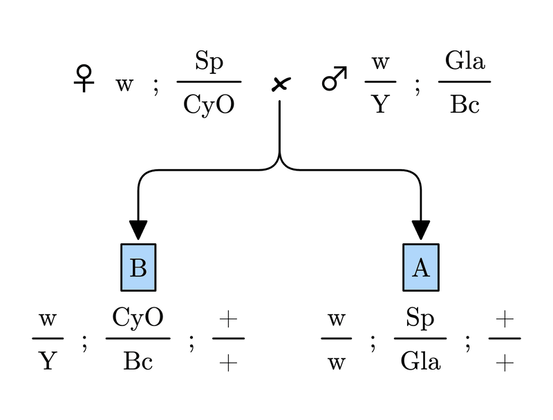

# excalidraw-genetics

An Obsidian plugin for drawing *Drosophila* genotypes and crossing schemes in Excalidraw, in a LaTeX-like look (Computer Modern), without typing LaTeX.

Each genotype is drawn as native Excalidraw elements (allele text, fraction lines, `;` separators, optional sex glyph), grouped, and tagged with a stable `genotypeId` in `customData`, so the plugin can find and redraw a genotype no matter how it has been moved or edited.

## Tour

**Genotype**: create a genotype with a form laid out like the genotype itself; select it and run it again to edit it in place.


**Cross Genotypes**: select two parents and pick one card per chromosome. The sex follows the X card, the preview updates live, and the label and selection criterion are optional.



**Cross Mode**: draw a red dashed line between two genotypes to cross them (Shift+9 suggested).



**Tidy** lays out a whole pedigree; **Tidy Below** tidies one branch and leaves everything above it alone.



**Select Below** picks a genotype with everything below it (descendants, their mates, and the arrows and labels between them); drag it anywhere and the arrow from its parents follows.



**Break Cross**: detach an offspring (or break a whole cross) without deleting any genotype; one undo brings it back.



## Commands

| Command | What it does |
|---|---|
| `Genotype` | Form for creating or editing one genotype: sex-symbol column plus a text field per homolog, laid out like the genotype (`X ; II ; III`, top over bottom). With a genotype selected it edits it in place (one undo step); for an offspring it also edits its label and selection criterion. With nothing selected it creates one at the nearest free spot to the view center. Option+F flips a chromosome (swaps its top and bottom text): the one under the mouse, or, with no hover, the one whose field has focus (focus then follows the text); a small `⇅` button beside each chromosome's header does the same on click. A chromosome carrying `Y` never flips. See `docs/plans/2026-09-28-genotype-form-editor-design.md`. |
| `Cross Genotypes` | Select two genotypes and pick the offspring: one card per distinct maternal × paternal homolog pair for each chromosome (identical cards, and cards that differ only in which parent gave which homolog, are merged), with the offspring sex linked to the X card (`Y` = male, XX = female, "or Y" = both sexes), a live preview, and optional label and multi-line selection criterion. Press F to flip a card (swap top and bottom, also selecting it); X cards that carry a Y never flip. Draws the offspring, the `x`, a bound elbow lineage arrow (the criterion rides on it as an arrow label), then runs Tidy. See `docs/plans/2026-09-28-cross-picker-design.md`. |
| `Cross Mode` | Toggle a quick-crossing mode: draw a red dashed line between two genotypes to cross them. An end in empty space creates a new genotype there first; empty to empty starts a new lineage. The mode turns off once the offspring is created; Esc (or cancelling the Genotype form) leaves it early. |
| `Tidy` | Lays out crosses: parents side by side with the `x` between them, offspring below, no overlaps. Nothing selected: every lineage. One genotype selected: its whole lineage. Several selected: exactly those, with everything else held still. Moves things as little as possible and keeps siblings in the order you placed them. A genotype crossed on two rows (a backcross to a parent, or a stock used again in a later generation) is drawn again beside its later mate, as an independent copy. |
| `Tidy Below` | Tidies the selected genotype and everything below it (its descendants and their mates); everything above stays put. |
| `Select Lineage` / `Select Below` | Select a genotype's whole lineage, or it and everything below it, with the `x` glyphs, arrows and labels in between, ready to drag. |
| `Break Cross` | Select an offspring to detach it from its parents, or the `x` (or both parents) to break the whole cross. Removes the `x`, lineage arrows and criteria involved; never deletes a genotype. One undo restores it. |

Every command is one undo step (Cmd+Z), including what it runs for you: a cross and the Tidy after it, Tidy Below's Select Below and Tidy, or a Cross Mode line with the genotypes and cross it makes. Cancelling a command's form records nothing, unless the command had already changed the drawing before the form opened (for example, turning a copied genotype into its own); then that change is its one undo step. Commands run from the command palette; they have no hotkeys by default, so assign your own in Settings → Hotkeys (search "Fly Genetics"). Suggested: Genotype, Cross Genotypes, Cross Mode (Shift+9), Tidy, Tidy Below, Select Below.

## Install (labmates)

1. In Obsidian, install and enable the **Excalidraw** community plugin (2.20.2 or newer) and the **BRAT** community plugin.
2. Settings → BRAT → Beta plugin list → **Add beta plugin**, enter `half-adder/excalidraw-genetics`, and add it. Enable **Fly Genetics** in Settings → Community plugins.
3. On first start Fly Genetics offers to set up the Computer Modern font (it writes the font and its SIL Open Font License to `Excalidraw/Fonts/` and turns on Excalidraw's local font with it, asking before replacing a different local font), and, if you used the scripts, offers to move the old installer's script files to the trash so each command does not appear twice. Only files whose content still matches what the installer wrote are preselected; an edited or unrelated file is listed but left unchecked. Nothing is trashed without an explicit "Move to trash" click. Drawings need no conversion.
4. Updates: BRAT checks for new versions at startup (its "Auto-update plugins at startup" setting) or when you run "BRAT: Check for updates to all beta plugins".

Notes:
- Excalidraw has one local-font slot per vault; the plugin asks before taking it over.
- Drawings look the same for everyone who has the font set up. Without it, genotypes fall back to Excalidraw's default font but stay fully editable.
- Hotkeys: the plugin's commands have new ids, so hotkeys set on the old script commands must be assigned again (Settings → Hotkeys, search "Fly Genetics").

## Install (development)

```bash
npm install
npm run build   # or: npm run dev
tools/dev-install.sh
```

After a rebuild: `obsidian plugin:reload id=fly-genetics`.

## Tests

Commands run inside a live Excalidraw view, so most tests drive Obsidian through the `obsidian` CLI in a throwaway drawing and clean it up afterwards. Each prints `PASS`/`FAIL` and exits 0 on PASS. By default they run the plugin's own commands, built from this checkout; set `FLY_ENGINE=scripts` to run them against the older Excalidraw/Scripts engine instead. `npm test` runs the Vitest unit tests (no Obsidian needed). `tests/run-all.sh` runs everything, including `npm test`, one after another.

- `tests/tidy-invariants.sh [drawing]`: on a copy of a real drawing, Tidy leaves no overlaps, no genotype on another cross's `x`, one bound arrow per offspring, and a second Tidy moves nothing.
- `tests/tidy-sibling-order.sh`: siblings keep the user's left-to-right order.
- `tests/tidy-sibling-cross-overlap.sh`, `tests/tidy-sibling-cross-chain.sh`, `tests/tidy-three-partners.sh`: crosses between siblings, chains, and one genotype with three mates.
- `tests/duplicate-genotype.sh`: a genotype copied with Cmd+D, copy/paste or alt-drag becomes its own genotype; copying a whole family (both parents, their `x` and offspring together) keeps it a family.
- `tests/tidy-backcross.sh`: a parent crossed on two rows gets a copy for each lower cross (backcross, existing drawings, two sisters, reused stock, sharing a copy on purpose).
- `tests/tidy-below.sh`: Tidy Below and tidying a hand-picked selection.
- `tests/tidy-joined-families.sh`: two families joined by a cross between one's child and the other's grandchild are laid out together, with every arrow present and routed around genotypes.
- `tests/genotype-label-criterion.sh`: editing an offspring's label and criterion in the Genotype form.
- `tests/genotype-form-flip.sh`: Option+F and the `⇅` button flip a chromosome in the Genotype form; a `Y`-bearing chromosome never flips.
- `tests/cross-mode-esc.sh`: Esc leaves Cross Mode.
- `tests/undo.sh`: every command is undone by one undo and redone by one redo, element for element.
- `tests/select.sh`: Select Below and Select Lineage pick the right genotypes and cross furniture.
- `tests/migration.sh`: the first-load offer to trash the old installer's scripts, including which files get preselected.
- `tests/font-setup.sh`: the first-load font setup offer.
- `tests/plugin-smoke.sh`: the plugin engine itself, that all eight commands are registered and available.

They take minutes each (they drive a live Obsidian); run them one at a time, not in parallel.

## Data model (schema v2)

Every element of a genotype carries `schemaVersion`, `kind` and `genotypeId` in `customData`:

| `kind` | Extra fields | Element |
|---|---|---|
| `genotype-allele` | `chromosome: "X"\|"II"\|"III"\|"IV"`, `side: "single"\|"top"\|"bottom"` | allele text |
| `genotype-fraction` | `chromosome` | fraction line |
| `genotype-separator` | `after: "X"\|"II"\|"III"` | `;` text |
| `genotype-glyph` | | sex symbol |
| `genotype-frame` | | invisible rectangle around the genotype and its label; lineage arrows bind to its top middle |
| `genotype-label` | `text` | optional label text above an offspring |
| `genotype-label-box` | `text` | light-blue, black-outlined box containing the label text |

Offspring elements also carry `parents: { maternal, paternal }` (genotype ids). Cross furniture:

| `kind` | Fields | Element |
|---|---|---|
| `cross-glyph` | `parents` | the `x` between two parents |
| `cross-lineage` | `childGenotypeId` | elbow arrow from the `x` (bottom middle) to the offspring frame (top middle), bound at both ends |
| `cross-criterion` | `childGenotypeId`, `text` | optional selection criterion, an arrow label bound to the lineage arrow (may be multi-line) |

## Roadmap

- **Allele vocabulary**: per-allele facts (balancer, dominant markers, recessive lethal) so the cross picker can put balancers on the bottom, flag lethal combinations such as `CyO/CyO`, and suggest selection criteria. See Future work in `docs/plans/2026-09-28-cross-picker-design.md`.
- **Recombinants** in the cross picker.
- **Stock library lookup**: fill the Genotype form from stock notes in the vault.

Cross Builder (the earlier keyboard-driven sidepanel) and the schema v3 plans are archived on the `archive/cross-builder` branch.

## License

Plugin and scripts: MIT (see `LICENSE`). The bundled Computer Modern Serif font (`fonts/cmu-serif-500-roman.ttf`) is under the SIL Open Font License (`fonts/CMU-OFL.txt`).
